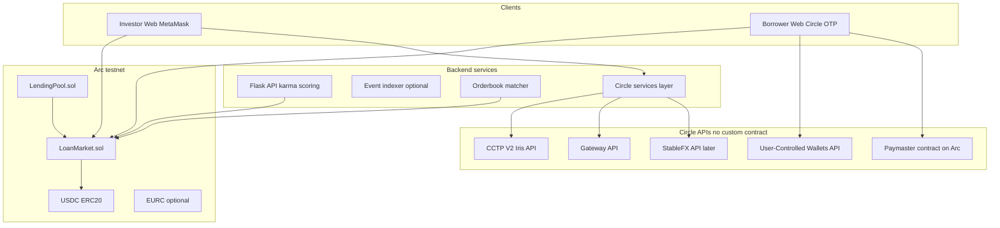

# YieldKarma — Technical Architecture

Companion to [CIRCLE_GRANT_PLAN.md](./CIRCLE_GRANT_PLAN.md). Describes smart contracts, Circle API integrations, and target repo layout.

---

## 1. System overview



**Principle:** Core lending logic lives in **your Solidity**. CCTP, Gateway, Wallets, and Gas Station are integrated via **SDKs/APIs** and **Circle-deployed contracts**—not reimplemented. **StableFX is post–2-week build** (see [CIRCLE_GRANT_PLAN.md §15](./CIRCLE_GRANT_PLAN.md#15-human-actions-checklist-your-to-do)).

**Your manual setup:** [CIRCLE_GRANT_PLAN.md §15 — Human actions](./CIRCLE_GRANT_PLAN.md#15-human-actions-checklist-your-to-do).

---

## 2. Smart contracts

### 2.1 Contract inventory

| Contract | Purpose | Replaces / notes |
|----------|---------|------------------|
| `LoanMarket.sol` | Loans, multi-lender fund, repay, history | Refactor of `MultitokenLoan.sol` |
| `LendingPool.sol` | ETF-style USDC pools → allocate to loans | New |
| `LoanMarketCCTPReceiver.sol` | Optional: receive CCTP mint + call `fundLoan` | New; or use Forwarding Service to borrower/contract |
| `MockUSDC.sol` | Local Hardhat only | Keep for tests |

**Not custom contracts:** Circle Paymaster (permissionless address per chain), TokenMessengerV2 / MessageTransmitterV2 (CCTP), Gateway Wallet contracts (Gateway deposits).

### 2.2 `LoanMarket.sol` — logic specification

Refactor [backend/contracts/MultitokenLoan.sol](../backend/contracts/MultitokenLoan.sol).

#### State

```solidity
// Roles (unchanged idea)
mapping(address => bool) isBorrower;   // was isBusiness
mapping(address => bool) isInvestor;

struct Loan {
    address borrower;
    uint256 principal;           // USDC 6 decimals
    uint256 interestBps;         // annual rate in bps
    uint256 durationMonths;
    uint256 dueDate;
    uint256 fundedAmount;        // NEW: cumulative funded
    uint256 totalPaid;
    uint256 monthlyPayment;
    bool repaid;
    string metadataURI;          // IPFS / https
    // payoutCurrency / EURC deferred until StableFX phase (post 2-week build)
}

// NEW: multi-lender
mapping(uint256 => mapping(address => uint256)) contributions;
mapping(uint256 => address[]) public lenders; // or emit-only index off-chain

uint256 public constant MIN_CONTRIBUTION = 25_000_000;  // $25
uint256 public constant MIN_PRINCIPAL = 50_000_000;      // $50
uint256 public constant MAX_PRINCIPAL = 2_000_000_000;  // $2000
```

#### Functions

| Function | Logic |
|----------|--------|
| `registerAsBorrower` / `registerAsInvestor` | Same as today; mutual exclusion |
| `requestLoan(principal, interestBps, durationMonths, metadataURI, payoutCurrency)` | Validate min/max principal; compute `monthlyPayment`; `fundedAmount = 0`; emit `LoanRequested` |
| `fundLoan(loanId, amount)` | `amount >= MIN_CONTRIBUTION`; `fundedAmount + amount <= principal`; `transferFrom` USDC investor → **borrower** (P2P); record `contributions[loanId][msg.sender] += amount`; append lender; if `fundedAmount == principal` emit `LoanFullyFunded` |
| `makePayment(loanId, amount)` | Borrower only; pro-rata or **waterfall**: pay each lender share of payment by `contributions / fundedAmount` (recommended: pro-rata each payment) |
| `getLoan`, `getContributions`, `getPaymentHistory`, `getBorrowerLoans` | Views for marketplace + history UI |
| `withdrawUSDC` | Owner rescue only |

#### Pro-rata repayment (core algorithm)

For payment `amount` on loan `id`:

```
for each lender L with contribution c:
  pay_L = amount * c / fundedAmount
  USDC.transferFrom(borrower, L, pay_L)
```

On final payment, set `repaid = true`.

#### Events (indexer-friendly)

- `LoanRequested`, `LoanFunded(loanId, lender, amount, newFundedAmount)`, `LoanFullyFunded`, `PaymentMade(loanId, lender, amount)`, `LoanRepaid`

#### Migration from `MultitokenLoan`

1. Rename file → `LoanMarket.sol`; rename contract.
2. Remove single `funder` field → `contributions` mapping.
3. Change `fundLoan(uint256)` → `fundLoan(uint256, uint256 amount)`.
4. Update `makePayment` to loop lenders.
5. Add principal bounds + `MIN_CONTRIBUTION`.
6. Keep interest math or extract `libraries/LoanMath.sol` if tests need it.
7. Update [backend/test/MultitokenLoan.test.js](../backend/test/MultitokenLoan.test.js) → `LoanMarket.test.js`.
8. Regenerate ABIs → `frontend/src/abis/arc/LoanMarket.json`.

**Template reference:** OpenZeppelin `ReentrancyGuard` on `fundLoan` / `makePayment`; OZ `SafeERC20` for USDC transfers.

---

### 2.3 `LendingPool.sol` — logic specification

One contract with multiple pools (cheaper than deploy-per-pool for MVP).

```solidity
struct Pool {
    string name;              // e.g. "AgriPool"
    uint256 totalDeposited;
    uint256 minKarmaBps;      // enforced off-chain or via oracle later
    uint16 categoryMask;      // optional
}

mapping(uint256 => Pool) public pools;
mapping(uint256 => mapping(address => uint256)) public shares; // poolId => investor => USDC deposited

function deposit(uint256 poolId, uint256 amount) external;
function withdraw(uint256 poolId, uint256 amount) external; // only unallocated idle
function allocateToLoan(uint256 poolId, uint256 loanId, uint256 amount) external onlyRole(ALLOCATOR);
```

**MVP allocator (team decision):** Backend hot wallet holds `ALLOCATOR_ROLE` and calls `allocateToLoan` / `fundLoan` when the orderbook matcher or pool rules assign capital.

**Flow:**

1. Investor deposits USDC into `LendingPool` (pool shares).
2. Off-chain job or admin `allocateToLoan` → `LoanMarket.fundLoan(loanId, amount)` from pool contract (pool must approve `LoanMarket`).
3. Repayments received by pool address; pro-rata share accounting to investors.

**Template reference:** Minimal vault pattern (ERC4626-style) — consider OpenZeppelin ERC4626 over USDC for share math if time permits; otherwise custom shares for speed.

---

### 2.4 CCTP — contract vs Forwarding Service

Two integration paths (pick one for MVP, both documented):

| Approach | Custom contract? | Best for |
|----------|------------------|----------|
| **A. Forwarding Service** | No | **Selected for MVP** — mint on Arc, then `fundLoan` (2 signatures) |
| **B. Custom hook receiver** | Yes — `LoanMarketCCTPReceiver` | Deferred — atomic mint + fund |

#### Approach A (MVP — team decision)

Use Circle docs: [transfer-usdc-with-forwarding-service](https://developers.circle.com/cctp/howtos/transfer-usdc-with-forwarding-service).

1. Investor on Base: `depositForBurnWithHook` + forwarding hook data.
2. USDC minted on Arc to `mintRecipient` (borrower or investor Arc address).
3. Investor `approve` + `LoanMarket.fundLoan` on Arc.

**Code templates:**

- [circlefin/cctp-sample-app](https://github.com/circlefin/cctp-sample-app)
- [gelatodigital/cctp-v2-gelato](https://github.com/gelatodigital/cctp-v2-gelato) — `CCTPReceiverV2` hook execution pattern

#### Approach B (atomic fund)

`LoanMarketCCTPReceiver.sol`:

- Implements CCTP V2 message handler (or uses Circle's receiver pattern from Gelato sample).
- On mint: `USDC.approve(LoanMarket)` + `LoanMarket.fundLoan(loanId, amount)`.
- `hookData` encodes `(loanId, minAmount)`.

**Circle contracts (do not redeploy):** `TokenMessengerV2`, `MessageTransmitterV2` — addresses from [CCTP contract addresses](https://developers.circle.com/cctp/references/contract-addresses).

---

## 3. Circle APIs & integration map

| Product | Type | Auth | Where in repo | How integrated |
|---------|------|------|---------------|----------------|
| **Arc RPC** | JSON-RPC | — | `backend/hardhat.config.js`, `frontend/.env` | Deploy & read contracts |
| **USDC / EURC** | ERC-20 | — | `backend/config/tokens.ts` | Addresses from Circle docs per chain |
| **CCTP V2** | Iris REST + on-chain burn | Public attestation API | `services/circle/cctp/` | Burn on source; poll `iris-api-sandbox.circle.com/v2/messages/{domain}?transactionHash=` |
| **Bridge Kit** | npm SDK | Wallet keys | `frontend/src/integrations/bridge/` | `kit.bridge({ from, to, amount })` — [Arc App Kit Bridge](https://docs.arc.io/app-kit/bridge) |
| **Gateway** | REST + on-chain deposit | Permissionless | `services/circle/gateway/` | `@circle-fin/unified-balance-kit`; [Gateway quickstart EVM](https://developers.circle.com/gateway/quickstarts/unified-balance-evm) |
| **User-controlled Wallets** | REST + Web SDK | `CIRCLE_API_KEY` | `frontend/src/wallets/borrower/` | Web SDK; phone OTP — **2-week build** |
| **Gas Station** | Circle API | API key | `frontend/src/wallets/borrower/gasStation.ts` | Sponsor borrower repay txs — **2-week build** |
| **StableFX** | REST RFQ API | Sales API key | `services/circle/stablefx/` | **Not in 2-week build** — add after USDC MVP |

### 3.1 Environment variables

```bash
# Arc
ARC_RPC_URL=
ARC_CHAIN_ID=
LOAN_MARKET_ADDRESS=
USDC_ADDRESS=
EURC_ADDRESS=

# Circle
CIRCLE_API_KEY=
CIRCLE_APP_ID=                    # Wallets SDK
CIRCLE_ENTITY_SECRET=             # If using server wallet ops

# CCTP
CCTP_IRIS_API=https://iris-api-sandbox.circle.com

# Gateway (2-week stretch)
GATEWAY_API_URL=

# StableFX — post 2-week build only
# STABLEFX_API_URL=
# STABLEFX_API_KEY=

# App
CHAIN=arc-testnet
VITE_API_URL=http://localhost:5000
```

### 3.2 CCTP service (backend or frontend)

```
services/circle/cctp/
  client.ts          # fetch fees, messages, attestation
  burn.ts            # depositForBurnWithHook via viem
  domains.ts         # domain IDs (Base, Arc, etc.)
  types.ts
```

**Flow "Fund from Base":**

1. `GET /v2/burn/USDC/fees/{src}/{dst}?forward=true`
2. `approve(TokenMessenger, totalAmount)`
3. `depositForBurnWithHook(..., mintRecipient=investorOnArc, hook=forwarding OR custom)`
4. Poll Iris until mint confirmed
5. `LoanMarket.fundLoan(loanId, amount)` on Arc

### 3.3 Gateway service

```
services/circle/gateway/
  client.ts
  deposit.ts         # deposit to Gateway wallet contract
  transfer.ts        # mint/spend unified balance on Arc
```

Use when investor funds **multiple loans** without bridging each time.

### 3.4 StableFX (deferred — not in 2-week build)

Do not implement `services/circle/stablefx/` in the current sprint. When ready: contact Circle sales, then add RFQ taker flow per [StableFX docs](https://developers.circle.com/stablefx.md).

### 3.5 Borrower wallet + Gas Station

```
frontend/src/wallets/borrower/
  CircleWalletProvider.tsx   # Web SDK init, phone OTP
  useBorrowerWallet.ts
  sendRepayment.ts           # USDC approve + makePayment via smart account
  gasStation.ts              # Enable sponsored txs via Console + SDK
```

**Templates:** [User-controlled Web SDK](https://developers.circle.com/wallets/user-controlled/web-sdk), [Gasless transaction quickstart](https://developers.circle.com/wallets/gas-station/send-a-gasless-transaction.md)

**Borrower gas:** **Gas Station** only for the 2-week build.

---

## 4. Off-chain services (Python + Node)

### 4.1 Flask API (`app.py` → package layout)

Refactor toward:

```
api/
  __init__.py
  app.py
  routes/
    karma.py           # GET borrower karma + history aggregates
    health.py
  services/
    karma_scorer.py    # repayment-only; reads chain events / subgraph
    chain_reader.py    # eth_getLogs LoanMarket events
```

**C9 logic:** Index `LoanRequested`, `PaymentMade`, `LoanRepaid` for borrower address → repayment rate, lateness, completed loans → Karma 0–100. **No wallet-graph FICO** for borrowers.

### 4.2 Orderbook matcher (C8)

**Hybrid RFQ** — orders off-chain, settlement on-chain.

```
services/orderbook/
  models.py            # LoanAsk, InvestorBid
  matcher.py           # match bids to asks by rate, karma, category
  store.py             # SQLite or Postgres for MVP
  api.py               # POST /bids, GET /book, POST /match/:id/execute
```

| Entity | Fields | Stored |
|--------|--------|--------|
| **LoanAsk** | loanId (on-chain), maxRate, category | chain + cache |
| **InvestorBid** | investor, maxRate, minKarma, maxExposure, categories[] | DB |

**Matcher rules:**

1. Bid `maxRate >= ask implied rate`.
2. Bid `minKarma <= borrower karma`.
3. Category match if specified.
4. Fill size = min(remaining loan, bid remaining exposure).

**Execute:** Returns tx payload: `LoanMarket.fundLoan(loanId, amount)` for investor wallet.

**No on-chain orderbook** for MVP (gas expensive). Optional future: `OrderBook.sol` storing bids as merkle commitments.

### 4.3 Event indexer (optional but helps C9 + marketplace)

```
services/indexer/
  listener.py          # websockets/logs
  handlers.py          # LoanFunded, PaymentMade
  db.py
```

Powers: marketplace live state, borrower history page, karma scorer without scanning chain per request.

---

## 5. Frontend module layout

```
frontend/src/
  config/
    chains.ts              # Arc testnet, chainId, RPC
    contracts.ts           # LoanMarket, USDC, LendingPool addresses
    tokens.ts
  lib/
    usdc.ts                # parseUsdc, formatUsdc (6 decimals)
  abis/
    arc/
      LoanMarket.json
      LendingPool.json
      IERC20.json
  contexts/
    InvestorWalletContext.tsx   # MetaMask (split from WalletContext)
    BorrowerWalletContext.tsx   # Circle OTP
  integrations/
    circle/
      cctp/
        fundFromBase.ts
      gateway/
        useGatewayBalance.ts
      # stablefx/  — post 2-week build
    contracts/
      loanMarket.ts          # read/write wrappers
      lendingPool.ts
  features/
    marketplace/
      LoanMarketplace.jsx
      LoanCard.jsx
      LoanDetail.jsx         # full borrower history + karma
      useLoans.ts
    investor/
      InvestorDashboard.jsx
      FundLoanModal.jsx
      FundFromBaseButton.tsx
    borrower/
      BorrowerDashboard.jsx
      RequestLoanForm.jsx
      RepayLoanModal.jsx
    pools/
      StakePool.jsx
      PoolCard.jsx
      usePoolDeposit.ts
    orderbook/
      OrderbookPage.jsx      # optional tab
      BidForm.jsx
      AskList.jsx
      useOrderbook.ts
    karma/
      BorrowerHistory.jsx
      KarmaBadge.jsx
  wallets/
    borrower/
      CircleWalletProvider.tsx
      paymaster.ts
  pages/                   # route shells → re-export features
  App.jsx
```

### 5.1 Marketplace vs orderbook

| Surface | Data source | Actions |
|---------|-------------|---------|
| **Marketplace** | On-chain `LoanMarket` + indexer | Browse open loans; `fundLoan`; view borrower history |
| **Orderbook** | `services/orderbook` API | Post bid; matcher suggests matches; execute `fundLoan` |

Marketplace = passive listing. Orderbook = active investor intent ("I want ≤8% in agriculture").

### 5.2 Pool UI

`StakePool.jsx` → calls `LendingPool.deposit(poolId, amount)`; displays share balance and allocated loans from indexer.

---

## 6. Backend / contracts repo layout

```
backend/
  contracts/
    LoanMarket.sol           # refactored
    LendingPool.sol
    LoanMarketCCTPReceiver.sol  # optional phase 2
    libraries/
      LoanMath.sol
    mocks/
      MockUSDC.sol
  scripts/
    deploy.ts                # Arc deploy all
    seed-loans.ts            # demo loans on testnet
    export-abis.ts
  test/
    LoanMarket.test.js
    LendingPool.test.js
  config/
    networks.ts              # Arc, Base Sepolia for CCTP
    addresses.arc.json
  services/                  # optional Node scripts for CCTP
    cctp/
```

Keep **Hardhat**; add `typescript` optional for CCTP scripts (or `scripts/cctp/` in repo root as `packages/circle/`).

Suggested monorepo stretch:

```
packages/
  web/          # move frontend
  contracts/    # move backend/contracts
  api/          # Flask
  services/     # orderbook, indexer
```

**2-week MVP (team decision):** Keep **flat** layout (`frontend/`, `backend/`, `app.py`); add `services/` at repo root for orderbook, indexer, and Circle helpers—not a full monorepo refactor.

---

## 7. Reference projects (templates)

| Need | Repository / doc |
|------|------------------|
| CCTP V2 sample | [circlefin/cctp-sample-app](https://github.com/circlefin/cctp-sample-app) |
| CCTP hook receiver | [gelatodigital/cctp-v2-gelato](https://github.com/gelatodigital/cctp-v2-gelato) |
| CCTP adapter patterns | [across-protocol/contracts CircleCCTPAdapter.sol](https://github.com/across-protocol/contracts/blob/master/contracts/libraries/CircleCCTPAdapter.sol) |
| Bridge UX | [@circle-fin/bridge-kit](https://www.npmjs.com/package/@circle-fin/bridge-kit), [Arc App Kit Bridge](https://docs.arc.io/app-kit/bridge) |
| Gateway | [@circle-fin/unified-balance-kit](https://www.npmjs.com/package/@circle-fin/unified-balance-kit) |
| Paymaster + AA | [Circle Paymaster quickstart](https://developers.circle.com/paymaster/pay-gas-fees-usdc), [circle-paymaster-aa-sdk-middleware](https://github.com/ksmith-circle/circle-paymaster-aa-sdk-middleware) |
| Wallets OTP | [User-controlled Web SDK](https://developers.circle.com/wallets/user-controlled/web-sdk) |
| Skills (agent-oriented) | [circlefin/skills](https://github.com/circlefin/skills) — `bridge-stablecoin`, `use-user-controlled-wallets`, `use-arc` |
| ERC20 + tests | Existing `MockUSDC` + OZ `SafeERC20` |

---

## 8. Implementation sequence (contracts-first)

| Step | Deliverable |
|------|-------------|
| 1 | `LoanMarket.sol` + tests + fix frontend USDC |
| 2 | Deploy Arc; seed loans script |
| 3 | Borrower Circle wallet + repay path |
| 4 | `LendingPool.sol` basic deposit/allocate |
| 5 | CCTP Forwarding Service + fundLoan (2 tx) |
| 6 | Gateway (stretch) + orderbook API + UI |
| 7 | Karma API from indexed events |
| 8 | IPFS metadata (C10) |
| — | **Later:** StableFX / EURC after H19 in human checklist |

---

## 9. Risk notes

| Risk | Mitigation |
|------|------------|
| StableFX | **Out of 2-week build** — USDC only |
| Gas Station | Enable in Circle Console (human action H12) |
| 2-week scope | LoanMarket + Arc + wallets + CCTP + Gas Station first |
| Pro-rata gas cost | Batch payments in one `makePayment` loop (limit lenders per loan if needed) |

---

*Update this doc when contract interfaces are frozen.*
