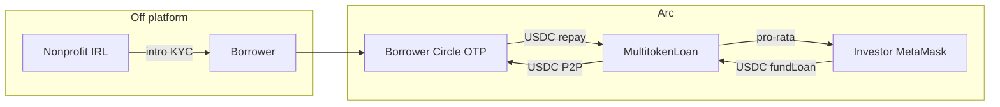
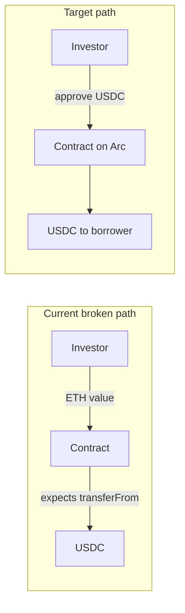
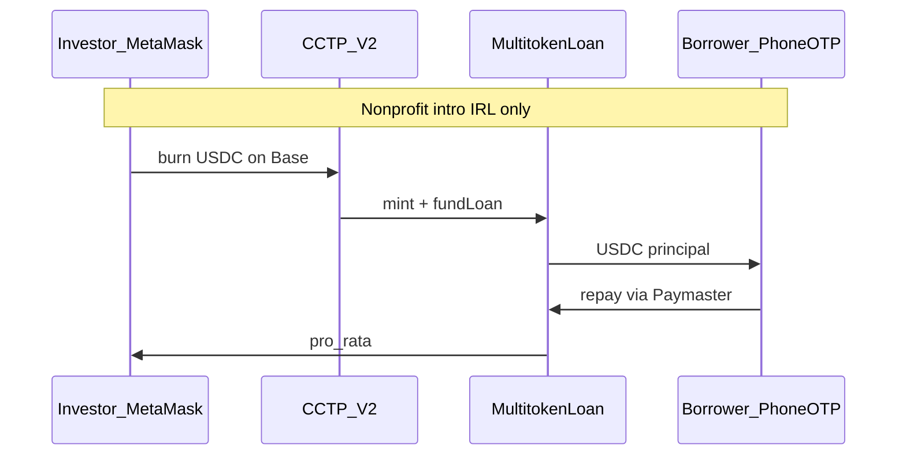

# YieldKarma — Circle Grant & Implementation Plan

**Status legend:** `Not started` | `In progress` | `Done`

This document is the single source of truth for grant preparation and engineering priorities for the [karma-kredit](..) / **YieldKarma** codebase.

**Technical detail (contracts, APIs, folder layout):** [ARCHITECTURE.md](./ARCHITECTURE.md)

---

## 1. Implementation philosophy

**Build Circle integrations before submitting the grant—not as funded milestones afterward.**

| Timeline | What it covers |
|----------|----------------|
| **Pre-grant (now)** | Phase A fixes, Circle/Arc integrations, product features (C1, C7, C8, C9, C10), demo on Arc testnet |
| **Post-grant (if accepted)** | Mainnet, nonprofit pilots (IRL), volume metrics, audits—not first-time SDK integration |

The grant application should show **what is already built on Arc testnet** (demo video + integration matrix). Proposed Circle milestones describe **scale and production**, not greenfield development.

---

## 2. Executive summary

**YieldKarma** is a cross-border microlending platform: SMB borrowers in emerging markets receive **USDC** from US retail investors who earn yield on repayments. Local **nonprofits are partnered in real life** for borrower access and KYC; **settlement is P2P on Arc** (investor ↔ borrower).

**Grant thesis (2-week build):** Arc settlement; USDC; **CCTP + Gateway** for investor liquidity; **Circle user-controlled wallets (phone OTP)** for borrowers; **Gas Station** for sponsored borrower txs; **MetaMask** for US investors; **public on-chain loan history + Karma**.

**Branding:** YieldKarma (repo: `karma-kredit`). **Build deadline:** ~2 weeks.

**Circle use cases claimed:** lending/borrowing. **StableFX / EURC** deferred until after the 2-week build (see §15).

---

## 3. Confirmed Circle stack

| Product | Status | Notes |
|---------|--------|-------|
| Arc L1 + USDC | In scope | Settlement; USDC gas |
| CCTP V2 | In scope | Cross-chain fund loans (e.g. Base → Arc) |
| Gateway | In scope (2-week) | Repeat investor liquidity |
| StableFX / EURC | **After 2-week build** | Not in current sprint |
| User-controlled wallets (phone OTP) | In scope (2-week) | Borrowers only |
| Gas Station | In scope (2-week) | Sponsor borrower gas (not Paymaster) |
| MetaMask | In scope | US investors |
| On-chain loan history (public) | In scope | Investors see borrower repayment history |
| Developer-controlled wallets | **Out** | Partners IRL; P2P on-chain |
| USYC | **Out** | All capital deployed to loans |
| Nanopayments | **Out** | — |
| Contract templates | **Out** | Custom Solidity |
| Signed credentials / private repayments | **Out** | Full history visible to investors |
| C6 trustee endorsements | **Out** | Removed from scope |
| C5 currency risk / fiat off-ramps | **Out** | No `fxModel`; no local fiat |

---

## 4. Circle product glossary

**USDC** — Dollar stablecoin (6 decimals). All loans, funding, repayments on Arc.

**CCTP** — Burns USDC on source chain, mints on Arc. Use for “Fund from Base/Ethereum” into a loan.

**Gateway** — Unified USDC balance across chains; fast moves for investors funding many loans. Build after CCTP works.

**StableFX / EURC** — *Not in the 2-week build.* Institutional FX API (USDC ↔ EURC on Arc). Add after core USDC loop ships; requires Circle API key via sales.

**User-controlled wallet (phone OTP)** — Borrower MPC wallet; sign-in via phone OTP; no MetaMask, no seed phrase.

**Gas Station** — Circle sponsors gas for user-controlled wallet transactions (borrower repay flow).

**Karma score** — Computed from **repayment history on YieldKarma** (not wallet-graph FICO). Shown alongside **full on-chain borrowing history** for each borrower so investors can underwrite.

**MetaMask** — US investors; CCTP/Gateway bring USDC to Arc.

**Nonprofits** — Off-platform (IRL): recruitment, trust, local KYC. Not a smart contract role or dashboard.

---

## 5. Wallet & money-flow model



| User | Wallet | Why |
|------|--------|-----|
| Borrower | Circle user-controlled + Gas Station | Phone OTP; sponsored gas on repay |
| US investor | MetaMask + CCTP/Gateway | Crypto-native; no Circle wallet required |
| Nonprofit | Off-platform (IRL) | Not a wallet product |
| Stake pool | On-chain USDC | Auto-match to loans; no USYC |

---

## 6. Current codebase snapshot

| Layer | Location | State |
|-------|----------|--------|
| Contracts | `backend/contracts/MultitokenLoan.sol`, `MockUSDC.sol` | USDC ERC-20; single funder; tests use 6 decimals |
| Deploy | `backend/scripts/deploy.js` | Sepolia USDC; **no Arc yet** |
| Frontend | `frontend/src/` | React/ethers; MetaMask; hardcoded marketplace loans |
| Scoring | `app.py`, `run_fico_pipeline.py` | FICO + Karma API |
| Pools UI | `frontend/src/pages/StakePool.jsx` | Static mock data |

### Known bugs (Phase A blockers)

1. **USDC decimals** — Frontend uses `parseEther` (18); USDC is 6 decimals (`WalletContext.jsx`, dashboards).
2. **Native ETH vs USDC** — `fundLoan` / `makePayment` pass `{ value }` (ETH); contract uses `usdc.transferFrom`.
3. **`requestLoan` ABI** — Frontend passes 5 args; contract expects 4 (extra `tokenAddress`).
4. **PyUSD labels** — UI says "PyUSD"; should be USDC.
5. **Hardcoded loans** — `LoanMarketplace.jsx` demo data mixed with chain data.
6. **Chain mismatch** — API defaults `flow-evm`; frontend uses `sepolia` in places.



---

## 7. Phase A — Critical fixes (Sprint 1)

| ID | Item | Files / notes | Status |
|----|------|---------------|--------|
| A1 | `parseUsdc` / `formatUsdc` helpers (6 decimals) | `frontend/src/lib/usdc.js` | Done |
| A2 | USDC `approve` + `fundLoan`; `approve` + `makePayment(amount)` | `WalletContext.jsx` | Done |
| A3 | Fix `requestLoan(principal, interest, duration, metadataCID)` | `WalletContext.jsx` | Done |
| A4 | Rename PyUSD → USDC in UI | All frontend pages | Done |
| A5 | **Seed script** for on-chain demo loans | `backend/scripts/seed-loans.js` | Done |
| A6 | Regenerate ABIs after contract changes | `npm run deploy:local` / `deploy:arc` | Done (on deploy) |
| A7 | Arc testnet in Hardhat + deploy + env | `hardhat.config.js`, `deploy.js`, `.env.example` | Done |
| A8 | Single `CHAIN` env for API + frontend | `app.py`, `WalletContext` | Done |
| A9 | Align `makePayment` vs `repayLoan` bindings | `WalletContext.jsx` | Done |

**Exit criteria:** Borrower requests loan → investor funds with USDC → borrower repays → loan repaid on **Arc testnet**.

---

## 8. Phase B — Circle integrations (pre-grant)

### B1 — Core (Sprint 2)

| ID | Product | Deliverable | Status |
|----|---------|-------------|--------|
| B1.1 | Arc | Contracts + frontend on Arc testnet | Not started |
| B1.2 | USDC | End-to-end 6-decimal flows | Not started |
| B1.3 | Wallets | Borrower onboarding via **phone OTP** | Not started |
| B1.4 | Gas Station | Sponsored gas for borrower wallet txs | Not started |

### B2 — Cross-chain (Sprint 3–5, 2-week build)

| ID | Product | Deliverable | Status |
|----|---------|-------------|--------|
| B2.1 | CCTP V2 | Forwarding Service → Arc, then `fundLoan` | Not started |
| B2.2 | Gateway | Repeat investor unified balance (if time in 2 weeks) | Not started |

**Not in 2-week build:** B2.3 StableFX / EURC (see §15 human actions when you add it later).

**B exit criteria (2-week target):** Demo with **USDC on Arc**, **borrower Circle wallet**, **CCTP fund path**, **Gas Station** repay. Gateway is stretch. No StableFX in this window.



---

## 9. Phase C — Product features (pre-grant)

### C0 — Operations (not on-chain)

- Nonprofits: **IRL** partnerships only.
- Money: **P2P** investor USDC → borrower; repayments pro-rata to investors (after C1).

### In scope

| ID | Feature | Summary | Status |
|----|---------|---------|--------|
| C1 | Multi-lender crowdfunding | Partial `fundLoan`; **$25 min** per lender; pro-rata repay; loans **$50–$2k** | Not started |
| C7 | Stake pools (ETF) | On-chain pool; auto-match USDC to loans; no USYC | Not started |
| C8 | Lending RFQ orderbook | Borrower asks + investor bids; off-chain match, on-chain fill | Not started |
| C9 | Karma + public loan history | Repayment-based score; investors see **full borrower history** on-chain | Not started |
| C10 | Borrower storytelling | IPFS metadata, photos, updates — **Sprint 6 / before apply** | Not started |

### Out of scope (digital / Kiva mechanics)

| ID | Feature | Reason |
|----|---------|--------|
| C2 | On-chain Field Partner role | IRL nonprofits only |
| C3 | Partner risk rating on-chain | Operational diligence |
| C4 | Pre-disbursal on-chain | P2P investor → borrower |
| C5 | Currency risk model | No fiat off-ramps |

### C11 — Remove legacy identity stack

- Remove **Worldcoin**, Gitcoin, wallet-graph FICO as borrower gate, and other on-chain KYC from README, UI, and grant copy.
- KYC narrative: nonprofit IRL + transparent on-chain repayment track record.

**C exit criteria:** Multi-lender P2P ($25 min, $50–$2k loans) + C7 + C8 MVP + C9 public history UI on Arc testnet.

### Removed from product scope (team decisions)

| Item | Reason |
|------|--------|
| C6 Trustee / endorsements | Not building |
| B3.1 Confidential / private repayments | Investors see full borrowing history |
| Signed credentials (hide history) | Replaced by public on-chain history + Karma |

---

## 10. Engineering sprints (pre-grant)

| Sprint | Focus | Includes |
|--------|-------|----------|
| 1 | Foundation | Phase A + Arc deploy — **code complete**; Arc deploy needs your `PRIVATE_KEY` + faucet USDC (H6–H10) |
| 2 | Circle core | B1.1–B1.4 |
| 3 | Cross-chain + P2P | B2.1–B2.2, C1, MetaMask investor path |
| 4 | Pools + orderbook | C7, C8 MVP (if time) |
| 5 | Credit + history UI | C9 repayment-based Karma + public borrower history |
| 6 | Polish + apply | C10 storytelling (IPFS), demo video, application prep |

**2-week note:** Prioritize A → B1 → C1 → demo. **StableFX not in this window.** C8/C7/B2.2 may slip if blocked.

---

## 11. Post-grant milestones (scale only)

| # | Milestone | Grant funds |
|---|-----------|-------------|
| G1 | Arc mainnet | Audit, deploy, monitoring |
| G2 | Nonprofit pilot (IRL) | 2–3 partners; $X disbursed P2P |
| G3 | Liquidity growth | Volume + investor count |
| G4 | Impact metrics | Repayment rate dashboard |
| G5 | Open source | Loan history + Karma scoring standards for Arc lenders |

**Placeholder metrics:** 200 borrowers, $500K disbursed, 95%+ repayment (12 months post-mainnet).

---

## 12. Grant application checklist

- [ ] 3-minute Arc testnet demo (working flows, not slides)
- [ ] Circle integration matrix (product → feature → file → status)
- [ ] Testnet contract links + ML API
- [ ] Team bios; nonprofit LOIs (IRL)
- [ ] Open-source pledge (G5)

---

## 13. Out of scope

- USYC, Nanopayments, Circle contract templates
- Developer-controlled partner wallets; on-chain Field Partner (C2–C4)
- C5 currency risk, local fiat off-ramps, `fxModel`, FX risk UI
- Worldcoin / Gitcoin / on-chain KYC vendors (C11)
- Full regulatory licensing; native mobile apps
- View keys / confidential transfers / signed credentials

---

## 14. Decisions log

| Topic | Decision |
|-------|----------|
| Grant deadline | ~**2 weeks** |
| Branding | **YieldKarma** |
| C9 scoring | **Repayment history only** (drop wallet-graph FICO for borrowers) |
| Investor visibility | **Full on-chain borrowing history** + Karma score |
| StableFX / EURC | **Removed from 2-week build**; USDC only until integrated later |
| C10 | **Sprint 6** (before apply) |
| C6 endorsements | **Removed** |
| Min investment | **$25 USDC** per lender |
| Loan size demo | **$50 – $2,000** |
| Demo loans | **On-chain seed script** on Arc testnet |
| Privacy / B3.1 | **Removed** — no private repayment amounts |

| Nonprofit narrative in grant doc | **Skip** — focus on engineering; no org names in plan |
| 2-week scope | **Ship full stack** — extend deadline only if blocked |
| CCTP MVP | **Forwarding Service** + separate `fundLoan` tx |
| Borrower gas | **Gas Station** (not Paymaster) |
| Pool allocator | **Backend wallet** with `ALLOCATOR_ROLE` |
| Repo layout | **Flat** + `services/` folder |

See [ARCHITECTURE.md](./ARCHITECTURE.md) for contracts, APIs, and file tree.

---

## 15. Human actions checklist (your to-do)

What **you** must do outside the codebase so engineering can proceed. Check off as you go.

### Week 0 — Accounts & keys (do first)

| # | Action | Why | Link / notes |
|---|--------|-----|----------------|
| H1 | Create **Circle Developer account** | API keys for Wallets, Gas Station | [developers.circle.com](https://developers.circle.com/wallets/create-api-key) |
| H2 | Create **API key** (testnet) | User-controlled wallets, Gas Station | Circle Console → API Keys; store in `.env`, never commit |
| H3 | Register **User-Controlled Wallets** app | Phone OTP borrower onboarding | Console → Wallets → configure auth (email/phone OTP) |
| H4 | Generate **Entity Secret** (if required by wallet setup wizard) | Server-side wallet ops | Follow Console prompts; backup secret securely |
| H5 | Add **Arc Testnet** to MetaMask (investor testing) | Fund loans from browser | [Arc network docs](https://docs.arc.network/) — chain ID + RPC from official docs |
| H6 | Get **Arc testnet USDC** for investor wallet | Fund / repay demos | Circle/Arc faucet or CCTP from Base Sepolia testnet USDC |
| H7 | Fund **Base Sepolia** (or Ethereum Sepolia) with test USDC | CCTP source chain | [Circle faucet](https://developers.circle.com/wallets/developer-console-faucet) |
| H8 | Create `.env` files from template | Unblock local dev | Copy keys into `/.env`, `/backend/.env`, `/frontend/.env` (gitignored) |

### Week 1 — While Sprint 1–2 run (contracts + Arc + wallets)

| # | Action | Why |
|---|--------|-----|
| H9 | Confirm **Arc USDC contract address** on testnet | Deploy script + frontend config |
| H10 | Deployer wallet: fund with **Arc USDC** (small amount) | Pay gas on Arc (USDC gas) for deploy + seed script |
| H11 | Test **borrower phone OTP** on a real phone | Verify Circle wallet flow in your country |
| H12 | Enable **Gas Station** for your wallet app in Console | Borrower repay without holding gas token |
| H13 | (Optional) Set up **Pinata** or **web3.storage** account | C10 loan images / IPFS metadata in Sprint 6 |

### Week 2 — While Sprint 3–6 run (CCTP, pools, polish)

| # | Action | Why |
|---|--------|-----|
| H14 | Test **CCTP** with your own MetaMask: Base Sepolia → Arc | Validate Forwarding + `fundLoan` before demo |
| H15 | (If shipping Gateway) Walk through [Gateway unified balance quickstart](https://developers.circle.com/gateway/quickstarts/unified-balance-evm) | Permissionless; still needs funded test wallets |
| H16 | Record **3-minute demo video** (screen + testnet txs) | Grant / portfolio; use seeded loans on Arc |
| H17 | Save **explorer links** for demo txs | Paste into integration matrix |
| H18 | Review app on mobile browser | Borrower OTP flow is mobile-first |

### Not required for the 2-week build (do later)

| # | Action | When |
|---|--------|------|
| H19 | Email **Circle sales** for **StableFX** API access | After USDC MVP is live |
| H20 | Grant application copy / nonprofit LOIs | Whenever you choose; not blocking code |
| H21 | Production audit / mainnet deploy | Post-grant (G1) |
| H22 | Legal / licensing review | Before real money beyond testnet |

### Environment variables you must supply

```bash
# You fill these; engineering wires the code
CIRCLE_API_KEY=
CIRCLE_APP_ID=                    # Wallets SDK
ARC_RPC_URL=
ARC_CHAIN_ID=
PRIVATE_KEY=                      # Deployer only; never commit
VITE_ARC_RPC_URL=
VITE_LOAN_MARKET_ADDRESS=         # After deploy
VITE_USDC_ADDRESS=
```

### If something is blocked

| Blocker | Your move |
|---------|-----------|
| No Arc faucet USDC | Bridge from Base via CCTP using test wallet |
| Circle OTP not available in region | Ask Circle support or test with email OTP if enabled |
| Gas Station not enabled | Check Console wallet app settings; fallback: fund borrower wallet with small USDC for gas |
| StableFX | **Ignore for 2 weeks** — all flows USDC-only |

---

*Last updated: consolidated from grant planning sessions. Iterate this file as decisions are made.*
